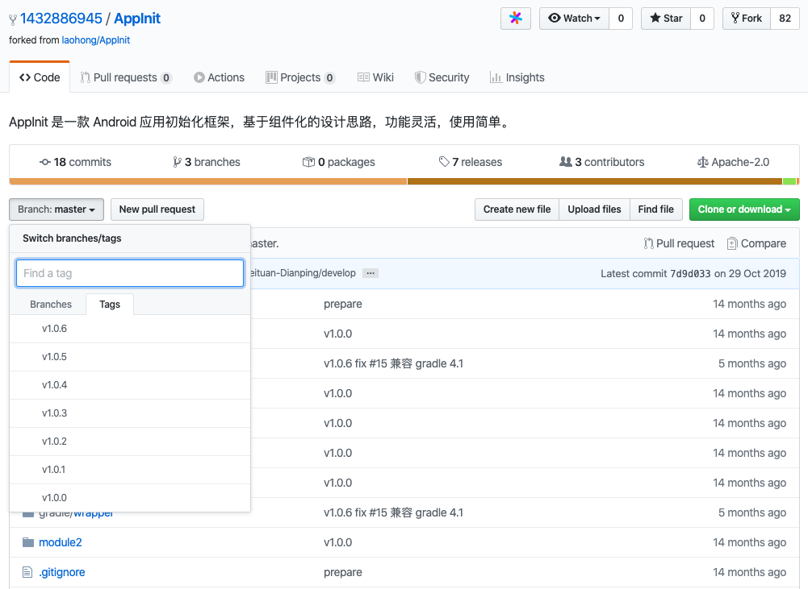

# AppInit：Android 应用初始化框架

AppInit 是一款 Android 应用初始化框架，基于组件化的设计思路，功能灵活，使用简单。

AppInit 用于解决美团收银 B 端 App 在业务演进过程中的实际问题，取得了不错的效果，因此我们决定将其开源，希望更多技术同行一起开发，应用到更广泛的场景里去。

## 背景

随着业务的快速发展，新项目新业务不断出现，以及项目组件化的实施，项目里需要初始化的业务模块和 SDK 也逐渐增多，而且有些业务模块间可能有着错综复杂的依赖关系，在项目开发和测试人员不足、新加入开发同学不熟悉项目的情况下，难免会出现少测漏测的情况，如何使各模块初始化代码解耦、按正确的顺序初始化是我们需要思考的问题。

## 功能简介

* 可以在指定进程的指定线程，按指定顺序分发 Application 生命周期方法给初始化类（继承自 SimpleAppInit 并添加 AppInit 注解，低耦合）
* 可以配置各模块间的初始化顺序，模块内部自己管理各初始化类的顺序，也可配置在其他模块的某个初始化类之前初始化（编译期间排序，运行期高性能）
* 可以在应用启动时拉取配置信息动态修改初始化顺序，及时修复线上包初始化顺序错乱问题（高稳定）
* 可以统计各模块和具体初始化类的初始化时间，便于优化冷启动时间

## TODO

* 非主 dex 懒加载
* 初始化线程池优化

## 业界初始化方案对比

## 设计与使用文档

* [使用文档](docs/user-manual.md)
* [设计文档](docs/principle.md)

## 更新日志

[更新日志](CHANGELOG.md)

## 免责声明

AppInit 于 2019 年 1 月 21 日以公司名义在 Meituan-Dianping 账号下开源 ，并于 2020 年 1 月 13 日停止从 Meituan-Dianping 账号开源。

由于之前开源的 1 年时间内已经有开发者将 AppInit 应用到了实际项目中，后续业务项目升级 Gradle 版本后可能也需要 AppInit 升级进行兼容，且在之前开源的 1 年时间内已经大量 Fork，因此再次 Fork 一份到个人账号下进行维护。代码包名不变，为了便于后续上传 JitPack，Gradle 依赖由「com.sankuai.erp.component:appinit-plugin」变为「com.github.bingoogolapple.AppInit:buildSrc」

