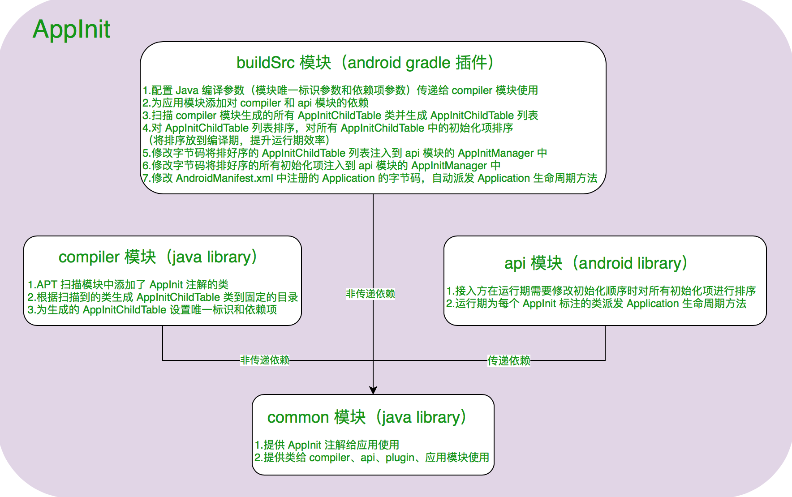
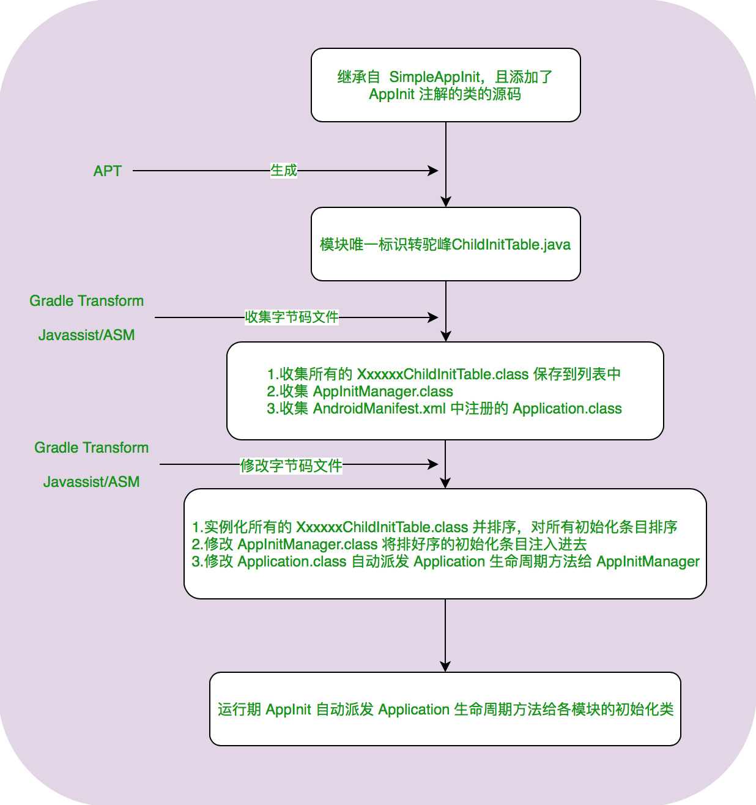
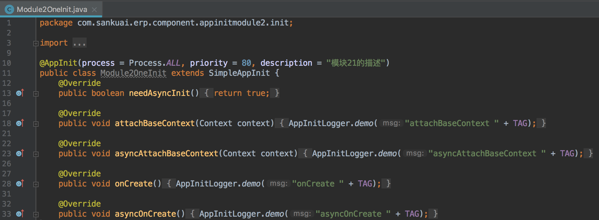
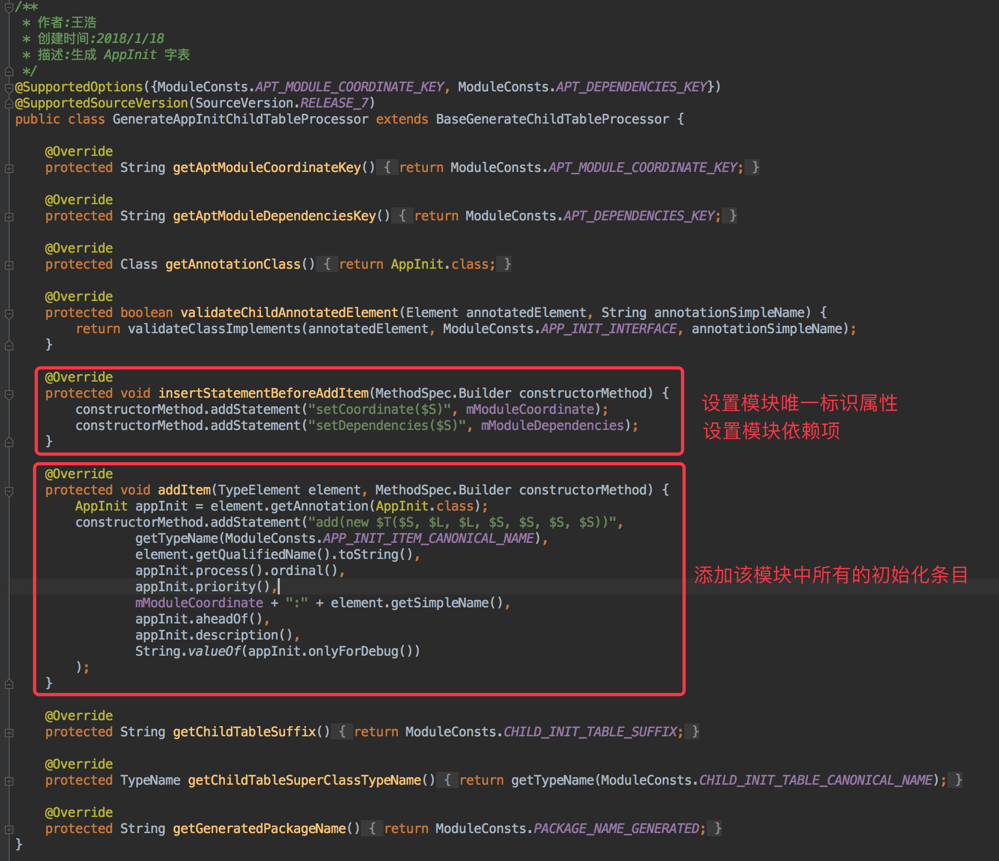
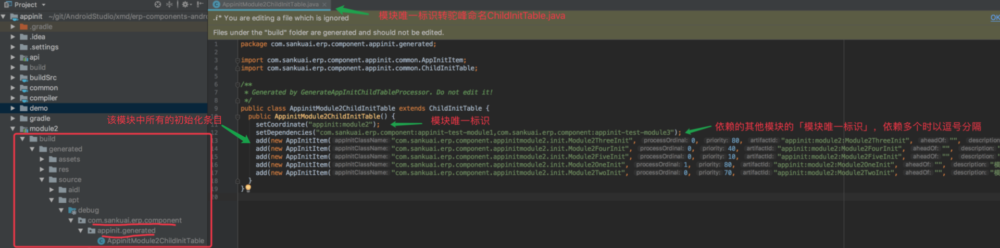
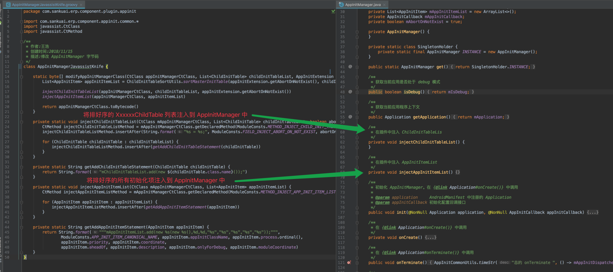
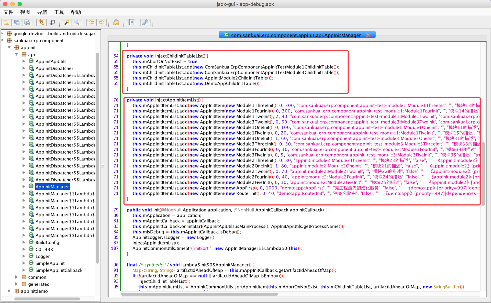
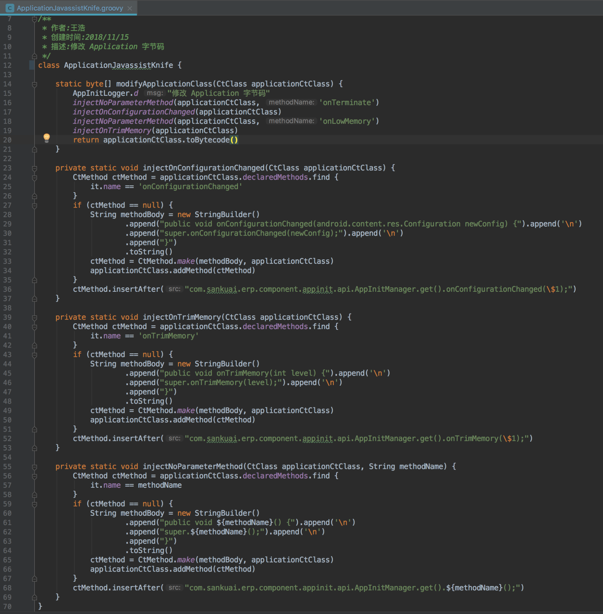
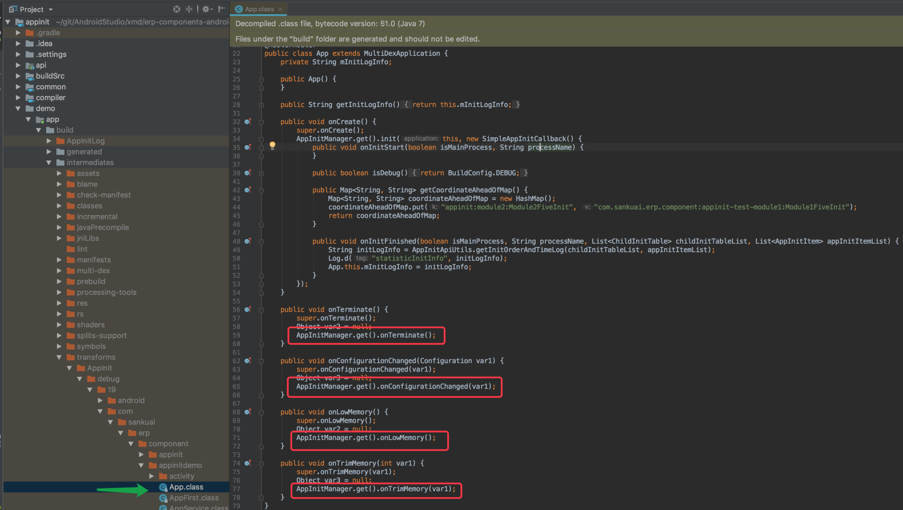
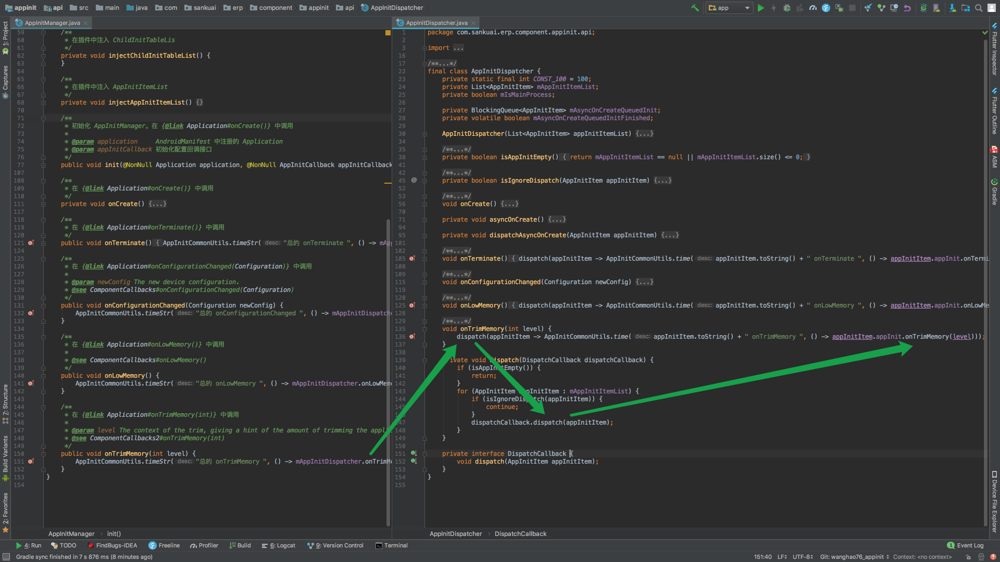

# AppInit-设计文档

## AppInit 演变史

### 第一版

* 定义一个统一的初始化接口 IAppInit，各个初始化类都实现该接口

```Java
public interface IAppInit {
    boolean needAsyncInit();
    void onCreate();
    void asyncOnCreate();
    void onTerminate();
    void onConfigurationChanged(Configuration newConfig);
    void onLowMemory();
    void onTrimMemory(int level);
}
```

* 添加所有的初始化项到 AppInitManager 中，在 Application 的生命周期方法调用 AppInitManager 对应的方法

```Java
public final class AppInitManager {
    private List<IAppInit> mAppInitList = new ArrayList<>();
    public static AppInitManager get() ...
    private AppInitManager() {
        mAppInitList.add(new BaseConfigInit()) // 初始化基础配置
        mAppInitList.add(new RobustInit()) // 初始化热修复
        mAppInitList.add(new PushInit()) // 初始化消息推送服务
        ...
    }
    private void onCreate() {
        // 遍历 mAppInitList 并同步分发给各个初始化类
    }
    public void onTerminate() ...
    public void onConfigurationChanged(Configuration newConfig) ...
    public void onLowMemory() ...
    public void onTrimMemory(int level) ...
}
```

#### 存在的问题

* AppInitManager 和各模块的初始化类紧密的耦合在一起，当有多个模块时，AppInitManager 必须放到最上层才能保证编译通过，不便于组件化的实施
* 上线前没发现初始化顺序错误，上线后 Crash，只能发新版本，没法动态修复初始化顺序
* 初始化的代码统一加到一个地方，在优化冷启动时间时，不便于定位具体是哪个模块或 SDK 的初始化比较耗时

为了解决上面的问题，需要我们的初始化框架具备以下特点：

* 初始化代码解耦
* 灵活配置初始化顺序、进程和线程
* 统计各模块和具体初始化类的初始化时间

### 第二版

每个初始化类添加 AppInit 注解，注解中传递 priority 参数（整个项目范围内的初始化顺序优先级），通过 APT 收集所有添加了 AppInit 注解的初始化类和对应的 AppInit 注解参数信息，将这些信息写入到特定位置，运行期反射获取这些信息并排序。这里业界有两种方式：

#### assets 方式

* 初始化类上添加 AppInit 注解，用于生成包含该模块所有初始化信息子表类
* 以该子表类的 canonicalName 作为文件名在「模块/build/intermediates/classes/debug/assets/AppInit/」目录下生成对应文件

```Java
private void writeModuleCanonicalNameAssetFile(Filer filer, String canonicalName) {
    Writer writer = null;
    try {
        FileObject fileObject = filer.createResource(StandardLocation.CLASS_OUTPUT, "", "assets/AppInit/" + canonicalName);
        writer = fileObject.openWriter();
    } catch (Exception e) {
        // 处理异常
    } finally {
        // 关闭流
    }
}
```

* `运行期`通过 AssetManager 获取每个模块的初始化类列表，`反射`加载类，实例化完所有初始化类再进行`排序`，最后再由 ApplicationDispatcher 分发应用生命周期

```Java
AssetManager assetManager = mApplication.getResources().getAssets();
String[] childInitTableCanonicalNameArr = assetManager.list('AppInit');
```

#### 生成始化的模块子表和整个应用的初始化主表方式

* 初始化类上添加 AppInit 注解，用于生成包含该模块所有初始化信息子表类（ModuleCanonicalNameChildInitTable）
* 壳工程中添加 MasterAppInit 注解，用于生成生成包含了所有子表类的主表类（MasterInitTable）
* `运行期`通过`反射`加载 MasterInitTable，并对所有的初始化类进行`排序`，最后再由 ApplicationDispatcher 分发应用生命周期

这两种方式存在的问题：

* priority 排序是基于整个应用范围的，新增业务模块需要增加一个初始化类时，不便于插入到具体的初始化位置（可能需要修改其他初始化类的 priority），跨团队合作时维护人员更是不敢随意修改 priority 的值
* 编译期无法查看整个应用的初始化顺序，如果开发同学经验不足、自测不够充分或者代码审查不够仔细，初始化顺序错误的 bug 很容易被带到线上
* 运行期反射、排序影响应用冷启动时间

### 第三版

相较于前两个版本的改进点如下：

* 通过模块下 gradle.properties 文件中的 APP_INIT_DEPENDENCIES 参数或 appInit 插件的 dependency 参数来配置应用启动时当前模块需要在哪些模块之后初始化
* 同样是在初始化类上添加 AppInit 注解，不过 priority 属性仅用于配置模块内部各初始化类的顺序
* 当 A 模块依赖 B 模块（A 模块需要在 B 模块之后初始化）时，如果 A 模块内部有一个初始化类需要在 B 模块某个初始化类之前初始化，可以通过配置 AppInit 注解的 aheadOf 参数来实现
* 编译期检测依赖的模块或初始化类是否存在，将错误暴露在编译期而不是运行期
* 编译期排序，减少冷启动时间
* 编译期输出初始化顺序日志文件，便于开发者调试初始化顺序

```
处理 aheadOf 前的顺序为：
    《com.sankuai.erp.component:appinit-test-module1》[priority=1]
        * [com.sankuai.erp.component:appinit-test-module1:Module1FiveInit][20][进程=MAIN][description=模块15的描述]
        * [com.sankuai.erp.component:appinit-test-module1:Module1TwoInit][90][进程=OTHER][description=模块12的描述]
        * [com.sankuai.erp.component:appinit-test-module1:Module1OneInit][100][进程=MAIN][aheadOf=com.sankuai.erp.component:appinit-test-module1:Module1TwoInit][description=模块11的描述]
        * [com.sankuai.erp.component:appinit-test-module1:Module1ThreeInit][300][进程=MAIN][description=模块13的描述]
        * [com.sankuai.erp.component:appinit-test-module1:Module1FourInit][300][进程=MAIN][description=模块14的描述]
    《com.sankuai.erp.component:appinit-test-module3》[priority=2][dependencies=com.sankuai.erp.component:appinit-test-module1]
        * [com.sankuai.erp.component:appinit-test-module3:Module3FiveInit][5][进程=MAIN][description=模块35的描述]
        * [com.sankuai.erp.component:appinit-test-module3:Module3FourInit][10][进程=MAIN][description=模块34的描述]
        * [com.sankuai.erp.component:appinit-test-module3:Module3ThreeInit][50][进程=MAIN][description=模块33的描述]
        * [com.sankuai.erp.component:appinit-test-module3:Module3OneInit][60][进程=ALL][description=模块31的描述]
        * [com.sankuai.erp.component:appinit-test-module3:Module3TwoInit][60][进程=MAIN][aheadOf=com.sankuai.erp.component:appinit-test-module1:Module1OneInit][description=模块32的描述]
    《appinit:module2》[priority=3][dependencies=com.sankuai.erp.component:appinit-test-module3]
        * [appinit:module2:Module2FiveInit][10][进程=MAIN][description=模块25的描述]
        * [appinit:module2:Module2FourInit][40][进程=MAIN][aheadOf=com.sankuai.erp.component:appinit-test-module3:Module3FourInit][description=模块24的描述]
        * [appinit:module2:Module2TwoInit][70][进程=MAIN][description=模块22的描述]
        * [appinit:module2:Module2ThreeInit][80][进程=MAIN][description=模块23的描述]
        * [appinit:module2:Module2OneInit][80][进程=ALL][description=模块21的描述]
    《demo:app》[priority=4][dependencies=appinit:module2, com.sankuai.erp.component:appinit-test-module1]
        * [demo:app:RouterInit][40][进程=MAIN][description=初始化路由]
        * [demo:app:AppFirst][1000][进程=MAIN][description=壳工程最先初始化服务]
最终的初始化顺序为：
    《com.sankuai.erp.component:appinit-test-module1》[priority=1]
        * [com.sankuai.erp.component:appinit-test-module1:Module1FiveInit][20][进程=MAIN][description=模块15的描述]
    《com.sankuai.erp.component:appinit-test-module3》[priority=2][dependencies=com.sankuai.erp.component:appinit-test-module1]
        * [com.sankuai.erp.component:appinit-test-module3:Module3TwoInit][60][进程=MAIN][aheadOf=com.sankuai.erp.component:appinit-test-module1:Module1OneInit][description=模块32的描述]
    《com.sankuai.erp.component:appinit-test-module1》[priority=1]
        * [com.sankuai.erp.component:appinit-test-module1:Module1OneInit][100][进程=MAIN][aheadOf=com.sankuai.erp.component:appinit-test-module1:Module1TwoInit][description=模块11的描述]
        * [com.sankuai.erp.component:appinit-test-module1:Module1TwoInit][90][进程=OTHER][description=模块12的描述]
        * [com.sankuai.erp.component:appinit-test-module1:Module1ThreeInit][300][进程=MAIN][description=模块13的描述]
        * [com.sankuai.erp.component:appinit-test-module1:Module1FourInit][300][进程=MAIN][description=模块14的描述]
    《com.sankuai.erp.component:appinit-test-module3》[priority=2][dependencies=com.sankuai.erp.component:appinit-test-module1]
        * [com.sankuai.erp.component:appinit-test-module3:Module3FiveInit][5][进程=MAIN][description=模块35的描述]
    《appinit:module2》[priority=3][dependencies=com.sankuai.erp.component:appinit-test-module3]
        * [appinit:module2:Module2FourInit][40][进程=MAIN][aheadOf=com.sankuai.erp.component:appinit-test-module3:Module3FourInit][description=模块24的描述]
    《com.sankuai.erp.component:appinit-test-module3》[priority=2][dependencies=com.sankuai.erp.component:appinit-test-module1]
        * [com.sankuai.erp.component:appinit-test-module3:Module3FourInit][10][进程=MAIN][description=模块34的描述]
        * [com.sankuai.erp.component:appinit-test-module3:Module3ThreeInit][50][进程=MAIN][description=模块33的描述]
        * [com.sankuai.erp.component:appinit-test-module3:Module3OneInit][60][进程=ALL][description=模块31的描述]
    《appinit:module2》[priority=3][dependencies=com.sankuai.erp.component:appinit-test-module3]
        * [appinit:module2:Module2FiveInit][10][进程=MAIN][description=模块25的描述]
        * [appinit:module2:Module2TwoInit][70][进程=MAIN][description=模块22的描述]
        * [appinit:module2:Module2ThreeInit][80][进程=MAIN][description=模块23的描述]
        * [appinit:module2:Module2OneInit][80][进程=ALL][description=模块21的描述]
    《demo:app》[priority=4][dependencies=appinit:module2, com.sankuai.erp.component:appinit-test-module1]
        * [demo:app:RouterInit][40][进程=MAIN][description=初始化路由]
        * [demo:app:AppFirst][1000][进程=MAIN][description=壳工程最先初始化服务]
```

* 运行期输出初始化顺序和初始化时间日志，便于开发者调试初始化顺序，更精准的定位导致冷启动慢的具体模块的具体初始化类


* 项目上线后，通过回调接口修改 aheadOf 来动态修复开发期间未发现的初始化顺序错误问题

## AppInit 原理

### AppInit 各模块功能说明



### AppInit 执行流程



#### 编写初始化类继承 SimpleAppInit 并 AppInit 注解

根据实际情况重写 Application 对应的生命周期方法



#### APT 在固定包「com.sankuai.erp.component.appinit.generated」下生成「模块唯一标识转驼峰命名ChildInitTable.java」 



生成的类在 build/generated/source/apt/debug/com/sankuai/erp/component/appinit/generated 目录下，该类中包含模块唯一标识，依赖的其他模块，以及该模块中所有的初始化条目



#### 扫描收集字节码文件

* 扫描收集 AppInitManager.class、AndroidManifest.xml 中注册的 Application.class
* 扫描所有 XxxxxxChildInitTable.class 添加到集合中

#### 排序并修改 AppInitManager 和 Application 字节码文件

* 实例化所有的 XxxxxxChildInitTable.class 并添加到集合中并排序，对所有的初始化条目排序
* 修改 AppInitManager.class 将排好序的 XxxxxxChildInitTable 列表以及初始化条目注入进去




* 「可选」当接入方配置了 applicationCanonicalName 时，修改 Application.class 自动派发 Application 生命周期方法给 AppInitManager「省去了每个接入方都要重写一便 Application 相应生命周期方法派发给 AppInitManager」




#### AppInitManager 中通过 AppInitDispatcher 分发 Application 生命周期给初始化条目

