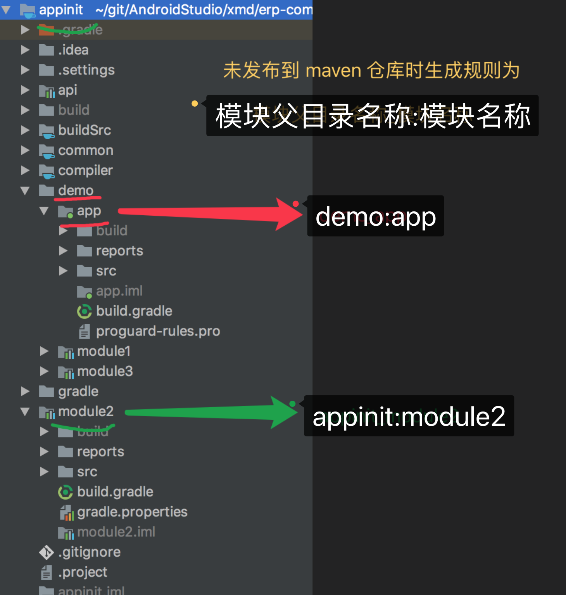
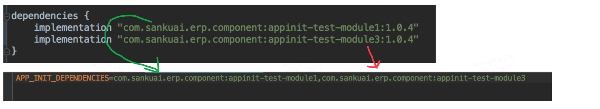
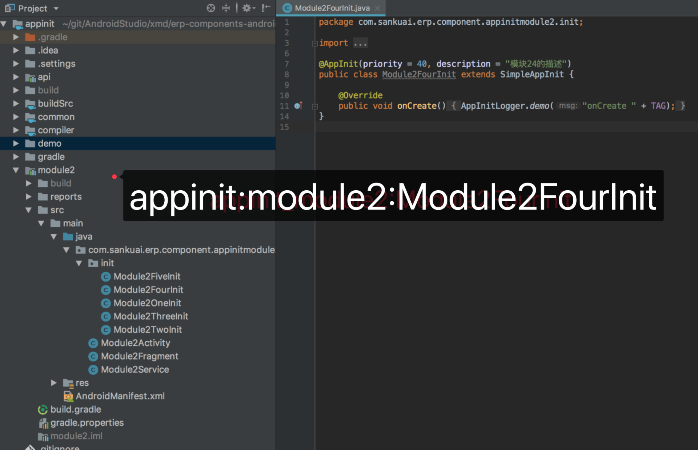
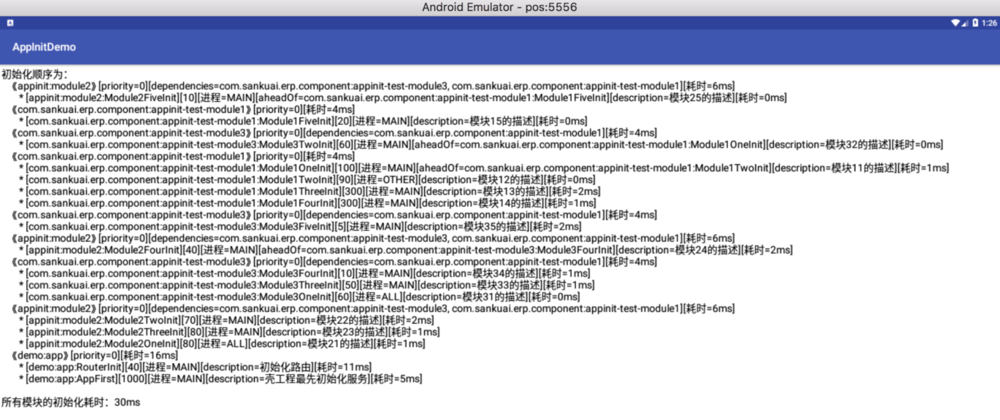

# AppInit-使用文档

## 1、AppInit 接入

* 根工程下的 build.gradle 中添加如下依赖 [](https://bintray.com/mtdp-erp/maven/appinit-plugin/_latestVersion)

```Groovy
classpath "com.sankuai.erp.component:appinit-plugin:最新版本号"
```

* 对应的 module 下的 build.gradle 中应用插件

```Groovy
apply plugin: 'appinit-plugin'
```

* 如果 module 中有用到 kotlin，需在 module 下的 build.gradle 中应用 kapt 插件

```Groovy
apply plugin: 'kotlin-kapt'
```

* 在 AndroidManifest.xml 中配置的 Application 中添加如下代码

```Java
public class App extends Application {

    public void onCreate() {
        super.onCreate();
        AppInitManager.get().init(this, new SimpleAppInitCallback() {
            /**
             * 开始初始化
             *
             * @param isMainProcess 是否为主进程
             * @param processName   进程名称
             */
            @Override
            public void onInitStart(boolean isMainProcess, String processName) {
                // TODO 在所有的初始化类之前初始化
            }

            /*
             * 是否为 debug 模式
             */
            @Override
            public boolean isDebug() {
                return BuildConfig.DEBUG;
            }

            /**
             * 通过 coordinate 自定义依赖关系映射，键值都是 coordinate。「仅在需要发热补的情况下才自定义，否则返回 null」
             *
             * @return 如果返回的 map 不为空，则会在启动是检测依赖并重新排序
             */
            @Override
            public Map<String, String> getCoordinateAheadOfMap() {
                return null;
            }

            /**
             * 同步初始化完成
             *
             * @param isMainProcess      是否为主进程
             * @param processName        进程名称
             * @param childInitTableList 初始化模块列表
             * @param appInitItemList    初始化列表
             */
            @Override
            public void onInitFinished(boolean isMainProcess, String processName, List<ChildInitTable> childInitTableList, List<AppInitItem> appInitItemList) {
                // 获取运行期初始化日志信息
                String initLogInfo = AppInitApiUtils.getInitOrderAndTimeLog(childInitTableList, appInitItemList);
                Log.d("statisticInitInfo", initLogInfo);
            }
        });
    }

    public void onTerminate() {
        super.onTerminate();
        AppInitManager.get().onTerminate();
    }

    public void onConfigurationChanged(Configuration newConfig) {
        super.onConfigurationChanged(newConfig);
        AppInitManager.get().onConfigurationChanged(newConfig);
    }

    public void onLowMemory() {
        super.onLowMemory();
        AppInitManager.get().onLowMemory();
    }

    public void onTrimMemory(int level) {
        super.onTrimMemory(level);
        AppInitManager.get().onTrimMemory(level);
    }
}
```

* 如果需要懒初始化，请在首屏 View 可见时调用`AppInitManager.get().startLazyInit();`

```java
firstVisibleView.getViewTreeObserver().addOnPreDrawListener(new ViewTreeObserver.OnPreDrawListener() {
    @Override
    public boolean onPreDraw() {
        firstVisibleView.getViewTreeObserver().removeOnPreDrawListener(this);
        AppInitManager.get().startLazyInit();
        return true;
    }
});
```

## 2、AppInit 使用

编写初始化类继承 SimpleAppInit，并添加 AppInit 注解，根据具体初始化场景重写相应方法。这里以初始化 Router 举例

```Java
@AppInit(priority = 40, description = "初始化路由")
public class RouterInit extends SimpleAppInit {
    @Override
    public void onCreate() {
        // SimpleAppInit 中包含了 mApplication 和 mIsDebug 属性，可以直接在子类中使用
        Router.initialize(mIsDebug);
    }
}
```

### 2.1、AppInit 注解属性说明

| 属性 | 描述 | 默认值 |
| ----------- | ----------- | ----------- |
| description | 初始化的描述信息 | "" |
| aheadOf | 在指定初始化项之前初始化，用于整个项目范围内重新排序。生成规则为「模块唯一标识:初始化SimpleName」 | "" |
| onlyForDebug | 初始化是否仅在 debug 时可用 | false |
| lazyInit | 懒初始化 | false |
| process | 在哪个进程初始化。可选值为 Process.MAIN（主进程）、Process.ALL（所有进程）、Process.OTHER（其他进程） | Process.MAIN（主进程） |
| priority | 模块内部范围内初始化类的优先级，值越小越先初始化 |  |

### 2.2、SimpleAppInit 方法说明

所有方法都是可选的，都只会运行在你注册的进程

| 方法 | 描述 |
| ----------- | ----------- |
| boolean needAsyncInit() | 是否需要异步初始化，默认为 false |
| void asyncOnCreate() | Application#onCreate() 时异步调用 |
| void onCreate() | Application#onCreate() 时同步调用 |
| void onConfigurationChanged(Configuration newConfig) | Application#onConfigurationChanged(Configuration) 时调用 |
| void onLowMemory() | Application#onLowMemory() 时调用 |
| void onTerminate() | Application#onTerminate() 时调用 |
| void onTrimMemory(int level) | Application#onTrimMemory(int) 时调用 |

## 3、AppInit 依赖配置

### 3.1、唯一标识（坐标）生成规则

#### 3.1.1、模块唯一标识（模块坐标）生成规则

* 未发布到 maven 仓库时生成规则为`「模块父目录名称:模块名称」`，如：



* 发布到 maven 仓库后生成规则为`「POM_GROUP_ID:POM_ARTIFACT_ID」`或`「GROUP_ID:ARTIFACT_ID」`，如：




#### 3.1.2、初始化类唯一标识（初始化类坐标）生成规则

* `「模块唯一标识:初始化类的SimpleName」`，如：




### 3.2、配置初始化顺序

#### 3.2.1、配置模块初始化顺序

* 对应模块的 gradle.properties 中配置当前模块所依赖的其他模块，多个依赖用英文逗号分隔

```properties
APP_INIT_DEPENDENCIES=com.sankuai.erp.component:appinit-test-module1,appinit:module2
```

* 在壳工程的 build.gradle 中配置 appInit 参数，`这种方式会覆盖通过 APP_INIT_DEPENDENCIES 配置的依赖`

```Groovy
appInit {
    // 自定义模块间初始化的依赖关系，会覆盖通过 APP_INIT_DEPENDENCIES 配置的依赖关系
    dependency([
            'demo:app'        : ['com.sankuai.erp.component:appinit-test-module1', 'appinit:module2'],
            'appinit:module2' : 'com.sankuai.erp.component:appinit-test-module3'
    ])
}
```

### 3.2.2、配置初始化类的顺序

* 添加 AppInit 注解时配置 priority 属性，指定模块内部范围内初始化类的优先级，值越小越先初始化
* 添加 AppInit 注解时配置 aheadOf 属性，指定项目范围内在其他初始化类之前初始化，优先级高于 priority
* 重写 SimpleAppInitCallback 的 getCoordinateAheadOfMap 方法，在运行期动态配置初始化顺序

```Java
/**
 * 通过 coordinate 自定义依赖关系映射，键值都是 coordinate。「仅在需要发热补的情况下才自定义，否则返回 null」
 *
 * @return 如果返回的 map 不为空，则会在启动时检测依赖并重新排序
 */
@Override
public Map<String, String> getCoordinateAheadOfMap() {
    Map<String, String> coordinateAheadOfMap = new HashMap<>();
    coordinateAheadOfMap.put("appinit:module2:Module2FiveInit", "com.sankuai.erp.component:appinit-test-module1:Module1FiveInit");
    return coordinateAheadOfMap;
}
```

### 3.2.3、根据日志调整初始化顺序

* 根据编译期日志调整初始化顺序。build 或 assemble 时会在控制台和 「壳工程/build/AppInitLog」目录下生成对应 Variant 的初始化顺序日志文件 「Variant.log」

```txt
2018-11-20 11:43:53

处理 aheadOf 前的顺序为：
    《com.sankuai.erp.component:appinit-test-module1》[priority=1]
        * [com.sankuai.erp.component:appinit-test-module1:Module1FiveInit][20][进程=MAIN][description=模块15的描述]
        * [com.sankuai.erp.component:appinit-test-module1:Module1TwoInit][90][进程=OTHER][description=模块12的描述]
        * [com.sankuai.erp.component:appinit-test-module1:Module1OneInit][100][进程=MAIN][aheadOf=com.sankuai.erp.component:appinit-test-module1:Module1TwoInit][description=模块11的描述]
        * [com.sankuai.erp.component:appinit-test-module1:Module1ThreeInit][300][进程=MAIN][description=模块13的描述]
        * [com.sankuai.erp.component:appinit-test-module1:Module1FourInit][300][进程=MAIN][description=模块14的描述]
    《com.sankuai.erp.component:appinit-test-module3》[priority=2][dependencies=com.sankuai.erp.component:appinit-test-module1]
        * [com.sankuai.erp.component:appinit-test-module3:Module3FiveInit][5][进程=MAIN][description=模块35的描述]
        * [com.sankuai.erp.component:appinit-test-module3:Module3FourInit][10][进程=MAIN][description=模块34的描述]
        * [com.sankuai.erp.component:appinit-test-module3:Module3ThreeInit][50][进程=MAIN][description=模块33的描述]
        * [com.sankuai.erp.component:appinit-test-module3:Module3OneInit][60][进程=ALL][description=模块31的描述]
        * [com.sankuai.erp.component:appinit-test-module3:Module3TwoInit][60][进程=MAIN][aheadOf=com.sankuai.erp.component:appinit-test-module1:Module1OneInit][description=模块32的描述]
    《appinit:module2》[priority=3][dependencies=com.sankuai.erp.component:appinit-test-module3]
        * [appinit:module2:Module2FiveInit][10][进程=MAIN][description=模块25的描述]
        * [appinit:module2:Module2FourInit][40][进程=MAIN][aheadOf=com.sankuai.erp.component:appinit-test-module3:Module3FourInit][description=模块24的描述]
        * [appinit:module2:Module2TwoInit][70][进程=MAIN][description=模块22的描述]
        * [appinit:module2:Module2ThreeInit][80][进程=MAIN][description=模块23的描述]
        * [appinit:module2:Module2OneInit][80][进程=ALL][description=模块21的描述]
    《demo:app》[priority=4][dependencies=appinit:module2, com.sankuai.erp.component:appinit-test-module1]
        * [demo:app:RouterInit][40][进程=MAIN][description=初始化路由]
        * [demo:app:AppFirst][1000][进程=MAIN][description=壳工程最先初始化服务]

最终的初始化顺序为：
    《com.sankuai.erp.component:appinit-test-module1》[priority=1]
        * [com.sankuai.erp.component:appinit-test-module1:Module1FiveInit][20][进程=MAIN][description=模块15的描述]
    《com.sankuai.erp.component:appinit-test-module3》[priority=2][dependencies=com.sankuai.erp.component:appinit-test-module1]
        * [com.sankuai.erp.component:appinit-test-module3:Module3TwoInit][60][进程=MAIN][aheadOf=com.sankuai.erp.component:appinit-test-module1:Module1OneInit][description=模块32的描述]
    《com.sankuai.erp.component:appinit-test-module1》[priority=1]
        * [com.sankuai.erp.component:appinit-test-module1:Module1OneInit][100][进程=MAIN][aheadOf=com.sankuai.erp.component:appinit-test-module1:Module1TwoInit][description=模块11的描述]
        * [com.sankuai.erp.component:appinit-test-module1:Module1TwoInit][90][进程=OTHER][description=模块12的描述]
        * [com.sankuai.erp.component:appinit-test-module1:Module1ThreeInit][300][进程=MAIN][description=模块13的描述]
        * [com.sankuai.erp.component:appinit-test-module1:Module1FourInit][300][进程=MAIN][description=模块14的描述]
    《com.sankuai.erp.component:appinit-test-module3》[priority=2][dependencies=com.sankuai.erp.component:appinit-test-module1]
        * [com.sankuai.erp.component:appinit-test-module3:Module3FiveInit][5][进程=MAIN][description=模块35的描述]
    《appinit:module2》[priority=3][dependencies=com.sankuai.erp.component:appinit-test-module3]
        * [appinit:module2:Module2FourInit][40][进程=MAIN][aheadOf=com.sankuai.erp.component:appinit-test-module3:Module3FourInit][description=模块24的描述]
    《com.sankuai.erp.component:appinit-test-module3》[priority=2][dependencies=com.sankuai.erp.component:appinit-test-module1]
        * [com.sankuai.erp.component:appinit-test-module3:Module3FourInit][10][进程=MAIN][description=模块34的描述]
        * [com.sankuai.erp.component:appinit-test-module3:Module3ThreeInit][50][进程=MAIN][description=模块33的描述]
        * [com.sankuai.erp.component:appinit-test-module3:Module3OneInit][60][进程=ALL][description=模块31的描述]
    《appinit:module2》[priority=3][dependencies=com.sankuai.erp.component:appinit-test-module3]
        * [appinit:module2:Module2FiveInit][10][进程=MAIN][description=模块25的描述]
        * [appinit:module2:Module2TwoInit][70][进程=MAIN][description=模块22的描述]
        * [appinit:module2:Module2ThreeInit][80][进程=MAIN][description=模块23的描述]
        * [appinit:module2:Module2OneInit][80][进程=ALL][description=模块21的描述]
    《demo:app》[priority=4][dependencies=appinit:module2, com.sankuai.erp.component:appinit-test-module1]
        * [demo:app:RouterInit][40][进程=MAIN][description=初始化路由]
        * [demo:app:AppFirst][1000][进程=MAIN][description=壳工程最先初始化服务]

scan 耗时:243ms
handle 耗时:201ms
transform 耗时:487ms
```

* 根据运行期日志调整初始化顺序、优化初始化耗时。在 AppInitCallback 的 onInitFinished 方法中可以调用「String initLogInfo = AppInitApiUtils.getInitOrderAndTimeLog(childInitTableList, appInitItemList);」获取运行期初始化顺序和各模块初始化耗时信息



## 4、扩展配置「可选」

* 依赖的模块或 aheadOf 指定的初始化类不存在时不中断编译

```Groovy
appInit {
    abortOnNotExist true
}
```

* 添加以下配置后 AppInit 会自动在 Application 的 onTerminate、onConfigurationChanged、onLowMemory、onTrimMemory 方法中调用 AppInitManager 对应的方法

```Groovy
appInit {
    // AndroidManifest.xml 中配置的 Application 的类全名
    applicationCanonicalName 'com.sankuai.erp.component.appinitdemo.App'
}
```

接入方不用再在 Application 中手动写以下代码

```Java
public void onTerminate() {
    super.onTerminate();
    AppInitManager.get().onTerminate();
}

public void onConfigurationChanged(Configuration newConfig) {
    super.onConfigurationChanged(newConfig);
    AppInitManager.get().onConfigurationChanged(newConfig);
}

public void onLowMemory() {
    super.onLowMemory();
    AppInitManager.get().onLowMemory();
}

public void onTrimMemory(int level) {
    super.onTrimMemory(level);
    AppInitManager.get().onTrimMemory(level);
}
```